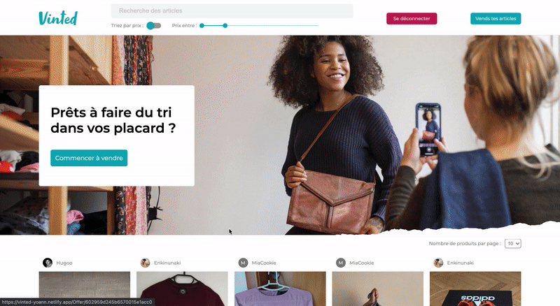

# Vinted - Frontend

<div align="center">


This Reactjs project is a copy of Vinted web site. The user can filter offers, publish new offer and buy items.
<br/>
<a href="https://vinted-yoann.netlify.app/">Netlify deploy</a> - <a href="https://github.com/YoannMas/vinted-API">Backend repository</a> 
</div>

## Screenshots

Filter offers


</br>

Publish new offer


</br>

Buy an item



## Dependencies

- axios
- fontawesome
- material UI
- stripe
- js-cookie
- node-sass
- react-multi-carousel


## Setup instructions

Clone this repository 

```
git clone https://github.com/YoannMas/vinted-react.git
```

Install dependencies

```
yarn install
```

Run it

```
yarn start
```
## Payment informations

If you want to buy an item, please use those payment informations (provide by Stripe for testing):
- Numéro de carte : 4242 4242 4242 4242
- MM/AA : 04 / 24
- CCV : 424
- Code postal : 24242
